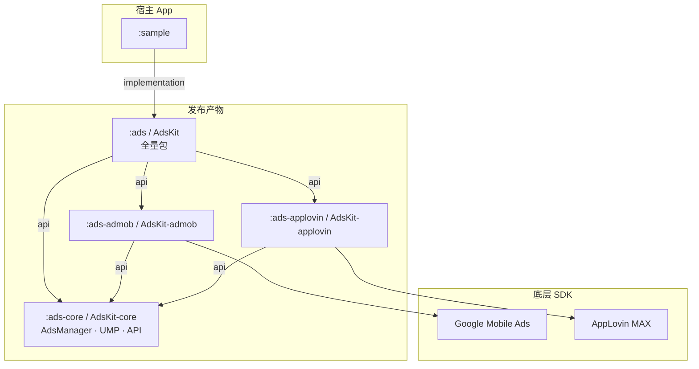
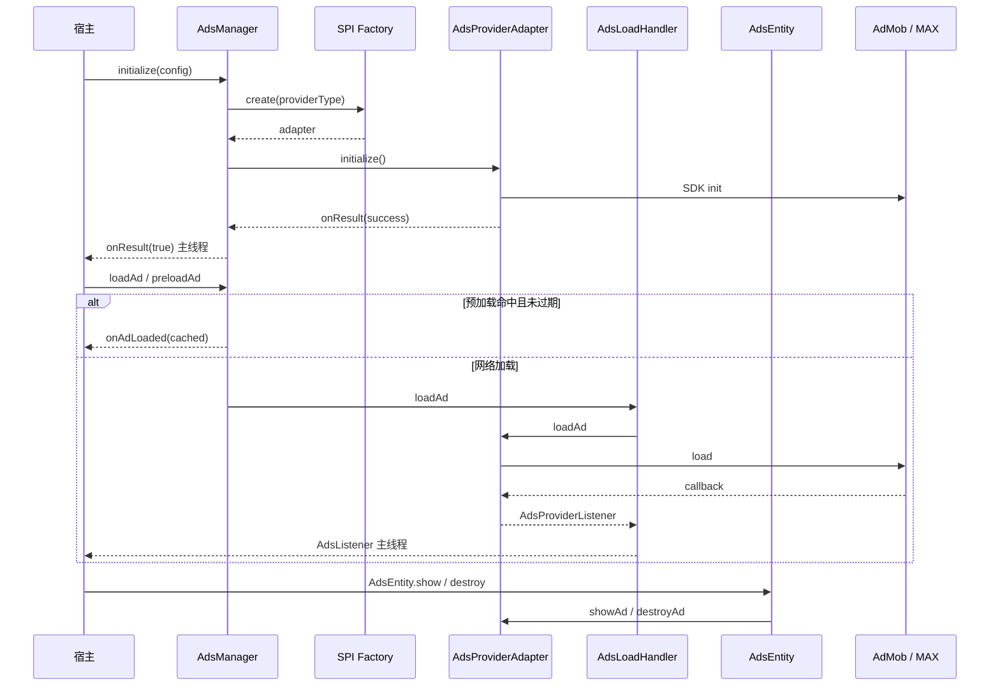
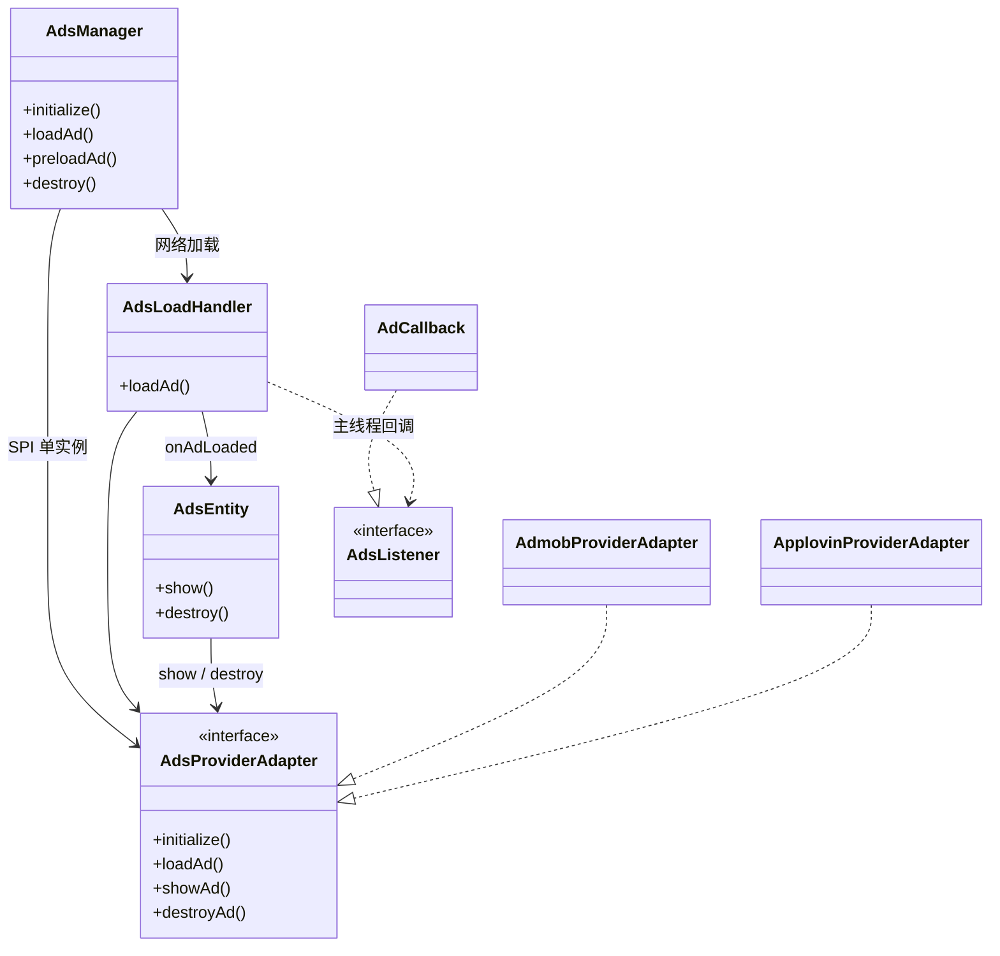

# AdsKit SDK

Android 广告聚合 SDK：统一封装 AdMob / AppLovin MAX，宿主通过单一门面 `AdsManager` 接入。

## 架构

单适配器模式：同一时刻只有一个 `AdsProviderAdapter` 生效；切换 Provider 需重新 `initialize()`（先销毁旧适配器并清空预加载缓存）。Provider 经 **Java SPI** 按 classpath 发现。

### 模块依赖



### 运行时调用链



### 核心类关系



## 模块与依赖

| 产物 | 模块 | 说明 |
|------|------|------|
| `AdsKit-core` | `:ads-core` | 公共 API、`AdsManager`、UMP |
| `AdsKit-admob` | `:ads-admob` | AdMob 适配器（传递依赖 core） |
| `AdsKit-applovin` | `:ads-applovin` | AppLovin MAX 适配器（传递依赖 core） |
| `AdsKit` | `:ads` | 全量包（core + admob + applovin，向后兼容） |

```kotlin
// JitPack — 按需选择
implementation("com.github.e-hai:AdsKit-admob:<version>")
implementation("com.github.e-hai:AdsKit-applovin:<version>")
implementation("com.github.e-hai:AdsKit:<version>") // 全量
```

| 场景 | 依赖 |
|------|------|
| 仅 AdMob | `AdsKit-admob` |
| 仅 AppLovin | `AdsKit-applovin` |
| 运行时切换 Provider | `AdsKit-admob` + `AdsKit-applovin`（或 `AdsKit`） |

本地开发默认：`implementation(project(":ads"))`。

### Sample 配置（`local.properties`）

```properties
admob.app.id=ca-app-pub-...
applovin.sdk.key=...
admob.test.device.id=...              # 可选，AdMob 测试设备哈希 ID
applovin.ad.unit.banner=...
applovin.ad.unit.rewarded=...
applovin.ad.unit.splash=...
applovin.ad.unit.interstitial=...
applovin.ad.unit.native=...
applovin.ad.unit.mrec=...
```

## 公开类型

| 类型 | 说明 |
|------|------|
| `AdsManager` | 单例门面；初始化状态机；预加载缓存（含 TTL） |
| `AdsInitState` | `IDLE` / `INITIALIZING` / `READY` / `FAILED` |
| `AdsEntity` | 已加载广告的展示句柄，`show()` / `destroy()` |
| `AdsListener` / `AdCallback` | 主线程回调 |
| `AdsPaidEvent` | 收益：`valueMicros` / `currencyCode` / `precision` |
| `AdsRequest` | `triggerId` / `adUnitId` / `adType` / `providerType` / `preloadTtlMs` |
| `AdsType` | 见下表 |
| `AdsProviderConfig` / `AdsProviderType` | Provider 配置 |
| `UMP` | Google UMP（`:ads-core`） |
| `AdsLogger` / `AdsDebug` | 日志开关；AdMob 测试设备 ID |

### AdsType

| 值 | 说明 | `container` |
|----|------|-------------|
| `BANNER` | 横幅 | **需要**，承载 Banner 视图 |
| `MREC` | 300×250 矩形 | **需要** |
| `NATIVE` | 原生广告 | **需要** |
| `SPLASH` | **App Open 开屏**（非普通 Splash 图） | 可传任意 `ViewGroup` |
| `INTERSTITIAL` | 插屏全屏 | 可传任意 `ViewGroup` |
| `REWARDED` | 激励视频 | 可传任意 `ViewGroup` |

> `SPLASH` 在底层对应 AdMob `AppOpenAd` / MAX `MaxAppOpenAd`。

## 核心 API

- **`initialize(app, config, onResult?)`** — 单适配器；同 Provider 跳过 → `true`；并发 → `false`；切换清预加载；`onResult` 主线程
- **`getInitState()` / `getInitializedProviderType()`**
- **`loadAd` / `preloadAd`** — 状态与 Provider 校验；预加载默认 TTL **55 分钟**（`AdsRequest.preloadTtlMs` 可覆盖）
- **`destroy()`** — 释放适配器并清空缓存
- **`openDebug(activity)`** — AdMob Ad Inspector / MAX Mediation Debugger

Provider 通过 **Java SPI** 注册；classpath 缺少对应模块时 `initialize()` 返回 `false`。

### 推荐流程

```
AdMob:     initialize → UMP.start() → loadAd
AppLovin:  UMP.start() → initialize → loadAd
```

### 回调

```
onAdStartedToLoad()
onAdLoaded(ad)
onAdFailedToLoad(error) / onAdFailedToLoad(error, errorCode?)
onAdShown() / onAdClicked() / onAdClosed()
onAdPaidEvent() / onAdPaidEvent(paid: AdsPaidEvent)
onAdUserEarnedReward()
onAdFailedToShow(error, errorCode?)
```

### 错误码

| 错误码 | 说明 |
|--------|------|
| `STATE_INITIALIZING` / `STATE_IDLE` / `STATE_FAILED` | 初始化状态不符 |
| `PROVIDER_MISMATCH` | Request 与已初始化 Provider 不一致 |
| `DISPLAY_*` | AppLovin 展示阶段错误 |
| SDK 原生码 | AdMob / AppLovin 透传 |

### 日志

- 过滤 Logcat **`AdsKit`** 可看到全部 SDK 日志（子 TAG 均含此前缀）
- 常用子 TAG：`AdsKit-Admob`、`AdsKit-AppLovin`、`AdsKit-AdsLoadHandler`、`AdsKit-UMP`、`AdsKit-Sample`
- 格式统一为 `key=value`，例如：
  - 核心：`onAdLoaded id=... unit=... type=... provider=...`
  - 适配器：`loadAd` / `onAdShown` / `onAdFailedToLoad` / `showAd` / `destroyAd`
  - 生命周期：`initialize start/complete`、`destroy`、`clearPreloadedAds`、`loadAd rejected`
- 失败用 `AdsLogger.e` / `w`；Release 默认静默（`AdsLogger.enabled` 跟随 `BuildConfig.DEBUG`）

```kotlin
// 可选：AdMob 测试设备（Sample 从 local.properties 注入）
AdsDebug.admobTestDeviceIds = listOf("YOUR_HASHED_DEVICE_ID")
```

## 使用示例

```kotlin
class App : Application() {
    override fun onCreate() {
        super.onCreate()
        AdsManager.initialize(
            this,
            AdsProviderConfig(AdsProviderType.ADMOB, "ca-app-pub-3940256099942544~3347511713"),
        ) { success ->
            Log.d("App", "init=$success state=${AdsManager.getInitState()}")
        }
    }
}

// UMP → 加载 Banner
UMP.start(activity) { _ ->
    val request = AdsRequest(
        triggerId = "home_banner",
        adUnitId = "ca-app-pub-3940256099942544/9214589741",
        adType = AdsType.BANNER,
        providerType = AdsProviderType.ADMOB,
    )
    AdsManager.loadAd(activity, request, object : AdCallback() {
        override fun onAdLoaded(ad: AdsEntity) {
            ad.show(activity, bannerContainer)
        }
        override fun onAdFailedToLoad(error: String, errorCode: String?) {
            Log.e("Ads", "load failed: $error ($errorCode)")
        }
        override fun onAdPaidEvent(paid: AdsPaidEvent) {
            Log.d("Ads", "revenue micros=${paid.valueMicros} ${paid.currencyCode}")
        }
        override fun onAdFailedToShow(error: String, errorCode: String?) {
            Log.e("Ads", "show failed: $error ($errorCode)")
        }
    })
}

// onDestroy：Banner / Native / MREC 需 destroy
override fun onDestroy() {
    adEntity?.destroy()
    super.onDestroy()
}
```

## 构建与发布

```bash
./gradlew publishToMavenLocal -Pgroup=com.github.ci -Pversion=test
./gradlew :ads-core:testDebugUnitTest
./gradlew :sample:assembleDebug
./scripts/check-artifact-sizes.sh com.github.ci test  # 可选，AAR/APK 体积门禁
```

- 版本号：统一在 `gradle/libs.versions.toml` → `sdkVersion`
- CI：`.github/workflows/build.yml`（publish、单测、Sample 构建、瘦身产物校验）
- JitPack：`jitpack.yml`（JDK 17）

更多实现细节、SPI、ProGuard、命名约定见 **`AGENTS.md`**。
